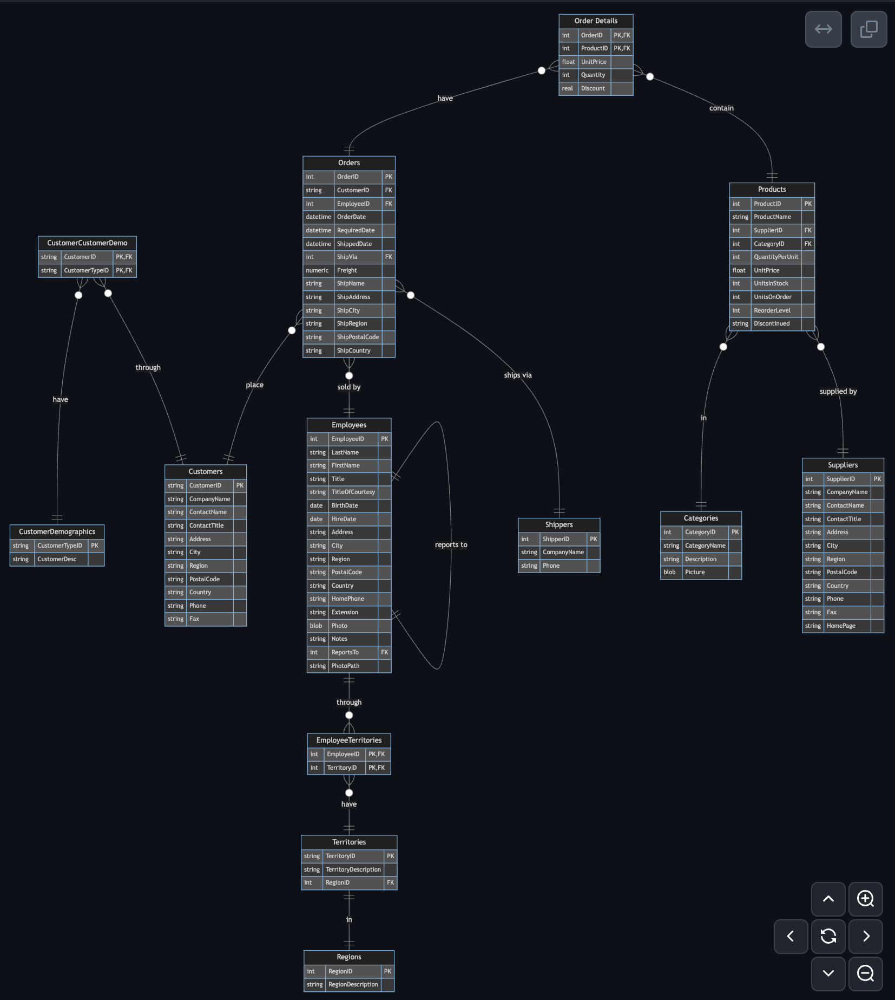

# Trabalhando com bancos de dados

## Northwind

Esta é uma versão do banco de dados de exemplo Northwind do Microsoft Access 2000, recriada para o SQLite3.

O banco de dados de exemplo Northwind foi fornecido com o Microsoft Access como um esquema de tutorial para gerenciar clientes, pedidos, estoque, compras, fornecedores, envio e funcionários de pequenas empresas. 

Northwind é um excelente esquema de tutorial para um ERP de pequenas empresas, com clientes, pedidos, estoque, compras, fornecedores, envio, funcionários e contabilidade de entrada única.

[Origin Repo](https://docs.yugabyte.com/preview/sample-data/northwind/)

