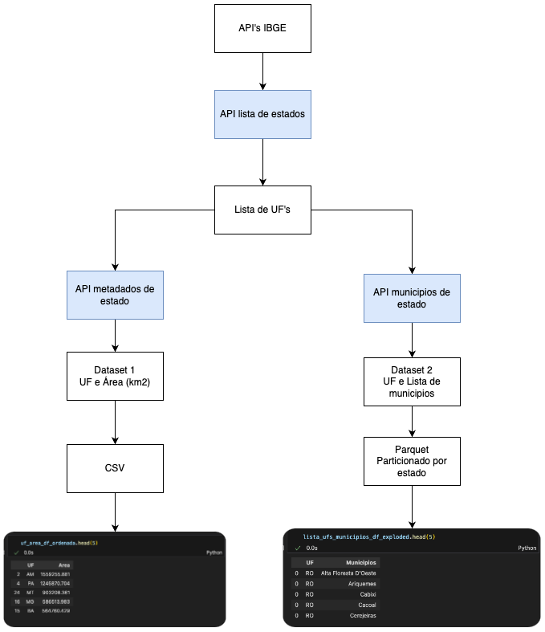

# Desafio Final

Vamos trabalhar com a extração de dados de API de localidades, forncecida pelo IBGE.

Dcoumentação Oficial da API:

https://servicodados.ibge.gov.br/api/docs/localidades

Nosso objetivo final será extrair dados de três API's

1. API de Estados
    - Objetivo: criarmos uma lista de estados do Brasil
    - Atenção: embora você possa simplesmente digitar uma lista com as siglas dos estados, o objetivo aqui é praticar o acesso a API's.
    - Endpoint: `http://servicodados.ibge.gov.br/api/v1/localidades/estados`

2. API com metadado dos estados
    - Objetivo: para cada estado na lista anterior, vamos extrair a area do estado.
    - Atenção: crie um dicionário com a sigla do estado e a área do estado.
    - Endpoint: `http://servicodados.ibge.gov.br/api/v3/malhas/estados/{UF}/metadados`

3. API com lista de municipios por estado
    - Objetivo: para cada estado na lista, vamos extrair a lista de municipios.
    - Atenção: crie uma lista contendo o nome dos municipios.
    - Endpoint: `http://servicodados.ibge.gov.br/api/v1/localidades/estados/{UF}/municipios`

Vamos gerar ao final desse desafio, dois datasets (conjuntos de dados):

| Dataset | Conteúdo | Formato de Arquivo |
| ------- | -------- | ------------------ |
| DATASET 1 | Todos os estados do Brasil, e a área de cada estado, ordenados por área. | CSV |
| DATASET 2 | Um dataset com todos os municípios do Brasil, e a UF a qual pertencem. | Parquet particionado por UF|

## Parte 1 - Extração de dados

Extrair estes dados das APIs listadas acima.

Saídas esperadas:

* Lista com todas as UF's do Brasil
* DATASET 1 - Dicionário com Area em km2 por UF do Brasil
* DATASET 2 - Dicionário com todos os munícipios por UF do Brasil

# Parte 2 - Transformação de dados

Saídas esperadas:

* Dataset 1
    * Transformar o dicionário com UF e Area em um DataFrame do Pandas.
    * Converter os tipos necessário (dica: função astype do pandas)
    * Ordenar o DataFrame pela coluna de Area em ordem decrescente (maior estado para o menor).

* Dataset 2
    * Transformar o dicionário com UF e Municipios em um DataFrame do Pandas.
    * Se necessário explodir os municipios em linhas (dica: função explode do pandas).

# Parte 3 - Salvando os dados

Vamos salvar os dados em dois formatos de arquivos diferentes:

1. DATASET 1
    * Exporte os dados para um arquivo CSV, na sua máquina.
    * Separador como `;`
    * Codificação como `utf-8`.

2. DATASET 2
    * Exporte os dados para um arquivo parquet, na sua máquina.
    * Particione os municipios por UF

# Parte 4 - Documentação e Publicação

1. Após finalizar o desafio, hospede seu código no seu github
2. Desenhe sua pipeline em alguma ferramenta de sua preferência (ex: draw.io)
3. Compartilhe sua implementação no linkedin, demonstrando o que você aprendeu e o que você conseguiu fazer.

# Parte 5 - Desafio Extra

Caso você tenha desenvolvido todo seu processo via notebook, tente reescrever seu código em formato de script python, e execute via linha de comando.

Use a biblioteca rocket-python para agendar seu script para rodar diariamente.